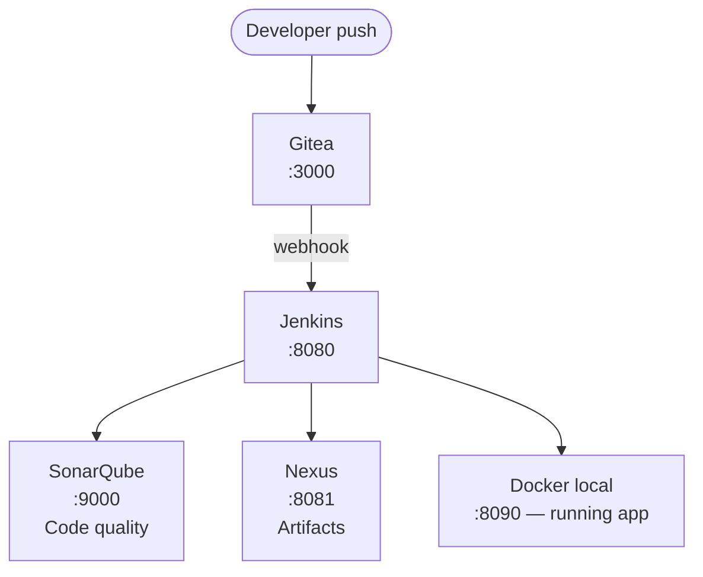

# CI/CD Pipeline — Jenkins + Gitea + SonarQube + Nexus

> A fully local, zero-cost CI/CD pipeline. With this project, you push code to a self-histed Git server and it automatically builds, tests, quality-checks, packages, and deploys your Java app, all inside Docker containers talking to each other on your laptop.

[](./Jenkinsfile)
[](./docker-compose.yml)
[](https://adoptium.net/)
[](./docker-compose.yml)
[](./LICENSE)

## What's in here
A fully local CI/CD pipeline orchestrated with Docker Compose. It spins up four services: Gitea (Git server), Jenkins (CI/CD), SonarQube CE (code quality), and Nexus OSS (artifact repo), and runs a real 8-stage pipeline against a Java/Maven app, ending with a live Docker deployment on your machine. No cloud accounts, no cost.
This repository contains the CI/CD pipeline infrastructure — the tooling that builds, tests, and deploys a Java application. It is not the application itself. To use this pipeline you need a separate Maven/Spring Boot project with a Jenkinsfile and Dockerfile at the root

- **docker-compose.yml**: wires up all four services on a shared Docker network
- **Jenkinsfile**: full Groovy pipeline with proper post {} blocks, timeout, credential injection, and quality gate enforcement
- **Dockerfile**: multi-stage image for the Java app
- **setup.sh + scripts/*: setup, initial config, and teardown helpers
- *jenkins/ directory*: Jenkins plugin config
- A solid **README** with architecture diagram, port map, and checklist

## Requirements

- Docker Desktop ?~I? 4.x with **at least 6 GB RAM** allocated
  *(Settings ?~F~R Resources ?~F~R Memory)*
- Git
- Java and Maven run inside Docker

## Architecture



## Quick Start

```bash
# 1. Clone this repo
git clone https://github.com/alexiglesias/cicd-localpipeline.git
cd cicd-project

# 2. Check prerequisites and start the stack
chmod +x setup.sh scripts/*.sh
./setup.sh

# 3. Wait ~2 min, then run the bootstrap helper
./scripts/initial-config.sh

# 4. Complete the manual steps printed by the script
#    (Jenkins unlock, plugin installs, credential setup)

# 5. Copy Jenkinsfile + Dockerfile into your Java project root, then push:
git remote add origin http://localhost:3000/devops-org/my-app.git
git push -u origin main
# → Pipeline triggers automatically via webhook
```

### Connecting Your Java Project

1. Copy `Jenkinsfile` and `Dockerfile` from this repo into the **root** of your Maven project
2. Edit `Jenkinsfile` — update these two lines:
   ```groovy
   APP_NAME  = 'my-app'          // your Maven artifactId
   NEXUS_REPO = 'maven-releases' // or maven-snapshots
   ```
3. Edit `Dockerfile` — it works for any standard Spring Boot / Maven project as-is
4. Push to Gitea → pipeline fires automatically

### Stop / Reset

```bash
# Stop (keep data)
./scripts/teardown.sh

# Full reset (delete all data)
./scripts/teardown.sh --volumes
```

## Project Layout
### Pipeline Stages

| # | Stage | What it does |
|---|-------|-------------|
| 1 | **Checkout** | Pulls source from Gitea |
| 2 | **Build** | `mvn clean package` ?~@~T compiles and packages the .jar |
| 3 | **Test** | `mvn test` ?~@~T runs JUnit tests, publishes results |
| 4 | **SonarQube Analysis** | Static analysis + coverage check |
| 5 | **Quality Gate** | Blocks pipeline if code quality thresholds fail |
| 6 | **Publish to Nexus** | Uploads versioned .jar to Nexus OSS |
| 7 | **Docker Build** | Builds multi-stage image, tags with build number |
| 8 | **Deploy** | Runs container locally on port 8090 |

### Stack ?~@~T 100% Free

| Tool | Role | Cost |
|------|------|------|
| [Gitea](https://gitea.io) | Self-hosted Git server | Free, OSS |
| [Jenkins LTS](https://www.jenkins.io) | CI/CD engine | Free, OSS |
| [SonarQube CE](https://www.sonarqube.org) | Code quality & coverage | Free, CE |
| [Nexus OSS](https://www.sonatype.com/products/nexus-repository) | Maven artifact repo | Free, OSS |
| [Docker Desktop](https://www.docker.com/products/docker-desktop/) | Container runtime | Free for personal use |

### Ports

| Port | Service |
|------|---------|
| 3000 | Gitea web UI |
| 2222 | Gitea SSH |
| 8080 | Jenkins |
| 8081 | Nexus |
| 9000 | SonarQube |
| 8090 | Your deployed app |

